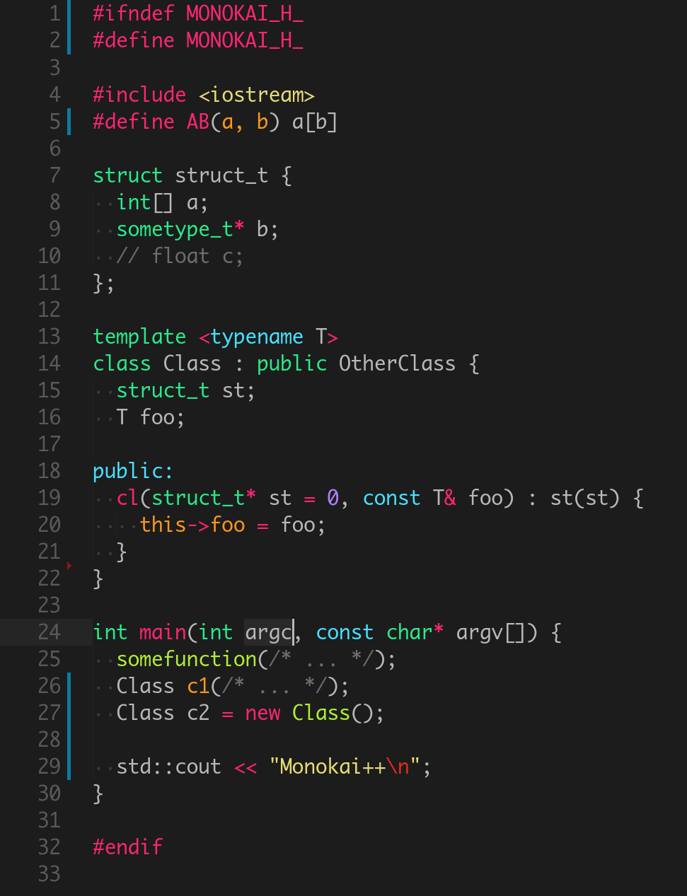

# Monokai++ Theme

A modern Monokai theme for Visual Studio Code.

## Install

`Ctrl/Command + Shift + P` to launch the command palette:

```
ext install monokai-plusplus
```

## Screenshot

C++ example code:



Based on the theme [Atom Monokai](https://github.com/burntime/atom-monokai) from [burntime](https://github.com/burntime).
