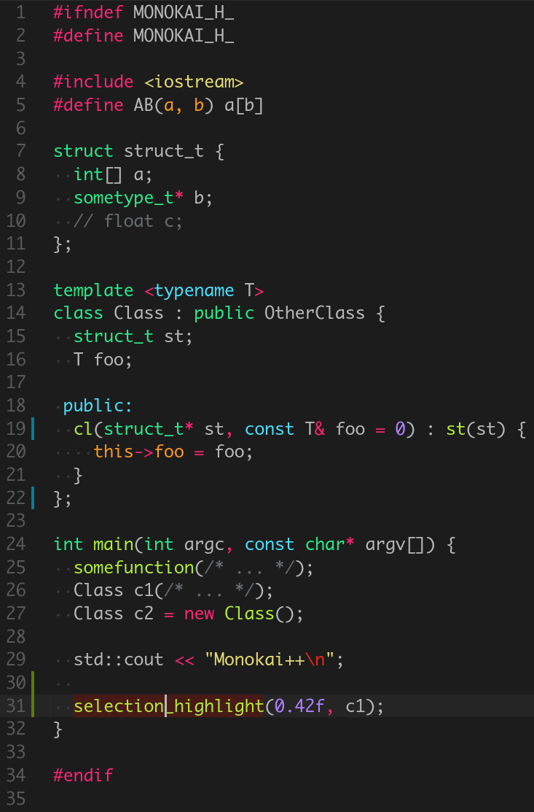

# Monokai++ Theme

A modern Monokai theme for Sublime Text 3 and Visual Studio Code.  
Feel free to open GitHub Issues to report any problem with the Color Scheme or submit suggestions.

## Installation

### Sublime Text 3

**Package Control:**

`Ctrl/Command + Shift + P` to open the Command Palette  
Select `Package Control: Install Package`  
Search for `monokai++`  
Press `Enter`

### Visual Studio Code

**Option 1:**

`Ctrl/Command + Shift + X` to open the Extensions tab  
Search for `monokai++`  
Click Install

**Option 2:**

`Ctrl/Command + P` to launch the command palette  
Write `ext install monokai-plusplus`

## Screenshots

Sublime Text 3 C++ example code

VS Code C++ example code

## Issues

Markdown fenced code highlight breaks with underscores on VS Code.

## Credits

Based on the theme [Atom Monokai](https://github.com/burntime/atom-monokai) from [burntime](https://github.com/burntime).
